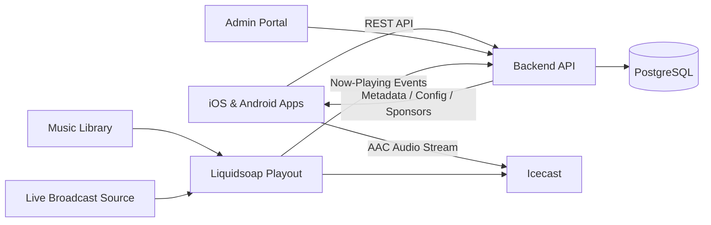

# Echoes Radio Platform

**Technical case study: designing and building a production mobile streaming radio platform from concept through launch.**

> This is a public portfolio repository. Production source code, credentials, and sensitive infrastructure details are intentionally kept private.

## At a Glance

**Echoes Radio** is an artist-driven streaming radio platform built around a simple listener experience: open the app and hear the same continuously programmed station as every other listener. The platform supports iOS and Android playback, live broadcast cut-ins, synchronized now-playing metadata, push notifications, sponsor content, administrative tools, and production operations.

**My role:** Product & Technical Lead — responsible for product definition, architecture, hands-on implementation, infrastructure, integration, testing, deployment, and mobile release.

## What I Owned

- Defined the V1 product scope, listener experience, technical requirements, and release plan.
- Designed the end-to-end architecture spanning mobile apps, APIs, database, streaming services, cloud infrastructure, admin tooling, and release workflows.
- Built and integrated the iOS and Android listener experience, including background audio, media controls, reconnect behavior, Bluetooth/headphone handling, and device-specific playback behavior.
- Built the backend/API and data layer for bootstrap configuration, stream information, now-playing metadata, sponsors, app policies, playback history, analytics, and administration.
- Configured and operated production streaming infrastructure, automated playout, live broadcast takeover, metadata synchronization, HTTPS/DNS routing, security controls, logging, and monitoring.
- Managed beta testing, device testing, TestFlight and Google Play distribution, store submissions, review cycles, release coordination, and post-release troubleshooting.

## High-Level Architecture

The architecture separates **audio delivery** from **application data and control**, allowing the stream to continue independently while the apps retrieve metadata, configuration, sponsor information, and operational state through the API layer.

## Technology Stack

| Area | Technologies |
| --- | --- |
| Mobile | React Native, native iOS/Android media integration |
| Backend | Node.js, Express, REST APIs |
| Data | PostgreSQL |
| Streaming | Icecast, Liquidsoap, FFmpeg, AAC |
| Cloud / Infrastructure | Google Cloud, Linux, HTTPS, reverse proxy, DNS |
| Notifications | Push notification infrastructure for iOS and Android |
| Distribution | Apple TestFlight, App Store Connect, Google Play testing and release tracks |

## Selected Engineering Challenges

**Reliable mobile playback** — Built recovery and playback behavior for foreground/background transitions, network interruptions, headphones, Bluetooth devices, lock-screen controls, notifications, and vehicle audio scenarios.

**Live broadcast takeover** — Designed automated source switching so a live event can temporarily override normal programming and safely fall back to the scheduled stream afterward.

**Metadata synchronization** — Built the pipeline that keeps artist and song information in the mobile apps aligned with the audio currently being broadcast.

**Production operations** — Implemented the supporting APIs, database structures, admin capabilities, access controls, diagnostics, logging, monitoring, deployment workflows, and rollback planning needed to operate the platform beyond a prototype.

**Cross-platform release** — Took the applications through physical-device testing, beta distribution, store metadata/privacy requirements, review cycles, production release, and iterative troubleshooting.

## AI-Assisted Engineering

I used modern AI-assisted development workflows to accelerate implementation, debugging, code review, and technical research while retaining ownership of the system architecture, integration decisions, testing strategy, production operations, and final technical judgment.

## What This Project Demonstrates

Echoes Radio required moving continuously between **product requirements, architecture, software development, APIs, cloud infrastructure, third-party integration, troubleshooting, and deployment**. It demonstrates my ability to translate a product idea into a working technical system, understand and communicate how the components fit together, solve integration problems across multiple technology layers, and carry a solution from concept through production.

That combination of technical depth and end-to-end solution ownership is the same approach I bring to **Solutions Engineering, Solutions Architecture, technical pre-sales, and customer-facing implementation work**.

---

### Repository Note

This repository is intentionally documentation-focused. Production application source code, secrets, credentials, private infrastructure configuration, and proprietary implementation details are maintained in private repositories.
